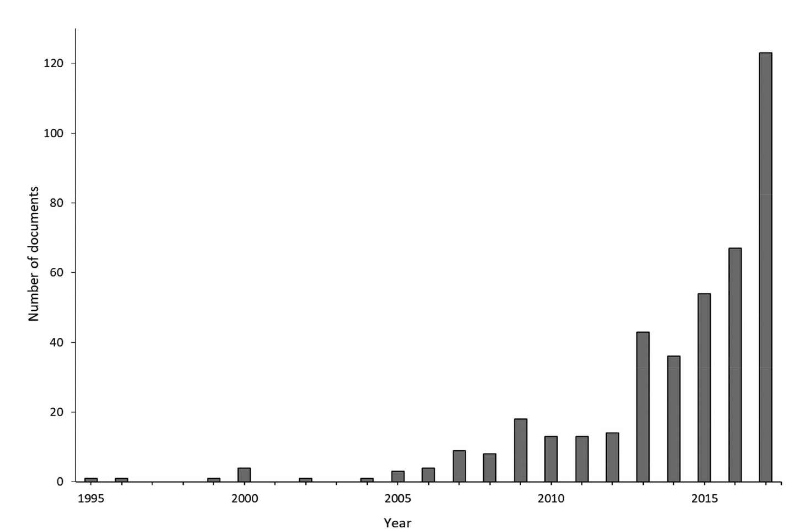
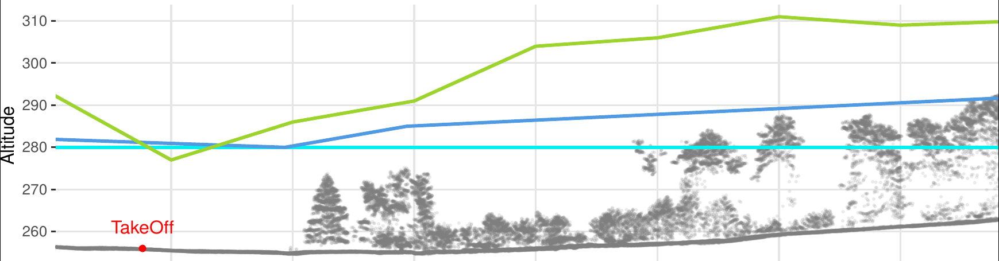
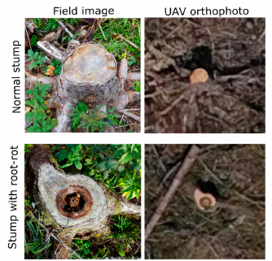

```{r setup, include=FALSE}
library(knitr)

opts_chunk$set(echo = FALSE,
               out.width = "75%", 
               fig.align = "center")
library(grid)
library(ggplot2)
library(mapview)
library(lidR)

library(rgl)
knitr::knit_hooks$set(webgl = hook_webgl)

```

```{r, fig.show = "hold", out.width = "70%"}
knitr::include_graphics(c("assets/logo_strip.jpg"))
```

-   Environmental monitoring and modelling
-   Remote Sensing
-   Machine Learning
-   UAS based data

------------------------------------------------------------------------

## UAS publications in agriculture and forest

```{r, fig.cap="Raparelli & Bajocco (2019)"}

```

## UAS publications in forests

### Technical studies

-   Structure from Motion in forests [@seifert2019]
-   Difficulties in forests [@iglhaut2019]
-   Workflows and quality assessment [@ludwig2020]

```{r, fig.cap="Difficulties in forests for flight planning"}

```

------------------------------------------------------------------------

### Forest inventory

-   canopy height [@wallace2016]
-   stem density
-   biomass
-   ...

```{r, fig.cap = "Wallace et al. 2016"}
knitr::include_graphics("assets/side_transect.png")
```

### Forest health

-   pest infections [@puliti2018]

-   dead crowns [@hese2019]

```{r, fig.cap="Puliti et al. 2019 - Detection of pest infected tree stumps", out.width="50%"}

```

------------------------------------------------------------------------

```{r, fig.cap="Hese et al. 2019", out.width="50%"}
knitr::include_graphics("assets/timeseries_green_red.png")
```

------------------------------------------------------------------------

# Goal: Operational workflow for UAS applications

-   nature conservation
-   environmental monitoring
-   research
-   forestry

## Study Area

```{r}
StudyArea = sf::st_read("data/mof_halfmoon.gpkg", quiet = TRUE)
mapview::mapview(StudyArea, fill = NA, color = "red", lwd = 2)
```

```{r, fig.cap="3DR Solo in the Marburg Open Forest"}
knitr::include_graphics("assets/field_uav.png")
```

```{r, fig.cap="Ground station setup in the Marburg Open Forest with pilot Simon"}
knitr::include_graphics("assets/field_simon.png")
```

## High resolution time series 2020

```{r}
knitr::include_graphics("assets/panel_details.png")
```

## Python scripts for semi-automated processing: Metashape Toolbox

-   Available at GitHub <https://github.com/envima/MetashapeTools>
-   Easy interface integration via the Python API
-   Modifications of the Metashape Workflow
-   greatly enhance reproducibility and reduce human error

```{r}

```

### Modification: Iterative pointcloud filtering

```{python, eval = FALSE, echo = TRUE}
MF.init(chunk, Metashape.PointCloud.Filter.ReprojectionError)
	RE = MF.values
	RE = max(RE)
	cp1 = 100
	
	while cp0 < cp1:
		 cp1 = cp0
		 RE = RE - 0.1
		 MF.init(chunk, Metashape.PointCloud.Filter.ReprojectionError)		
		 MF.selectPoints(RE)
		 chunk.point_cloud.removeSelectedPoints()
		 chunk.optimizeCameras(fit_f=True, fit_cx=True, fit_cy = True, fit_b1=True, fit_b2 = True, fit_k1 = True, fit_k2 = True, fit_k3 = True, fit_k4=True, fit_p1 = True, fit_p2 =True, adaptive_fitting=True)
		 
		 cp_error = []
		 for marker in chunk.markers:
			 if marker.reference.enabled == False and marker.enabled == True:
				 est = chunk.crs.project(chunk.transform.matrix.mulp(marker.position))  # Gets estimated marker coordinate
				 ref = marker.reference.location
				 if est and ref:
					 cp_error.append((est - ref).norm())  # The .norm() method gives the total error. Removing it gives X/Y/Z error
		 cp0 = statistics.mean(cp_error)
```

```{r}

```

### Toolchain: Orthomosaic Processing

```{python, eval = FALSE, echo = TRUE}

#!/usr/bin/env python3
# -*- coding: utf-8 -*-


import Metashape

from msFunctions.msSparseCloud import *
from msFunctions.msOrtho import *
from msFunctions.msError import *


def Toolchain02():
  ac = Metashape.app.getBool("Process all Chunks?")
  if ac:
    for chunk in Metashape.app.document.chunks:
      sparse2ortho(chunk)
      exportOrtho(chunk)
      exportSeamlines(chunk)
      exportMarker(chunk)
  else:
      chunk = Metashape.app.document.chunk
      sparse2ortho(chunk)
      exportOrtho(chunk)
      exportSeamlines(chunk)
      exportMarker(chunk)


Metashape.app.addMenuItem("MetashapeTools/Toolchain Part 2", Toolchain02)

```

```{r}


```

------------------------------------------------------------------------

# Literature
