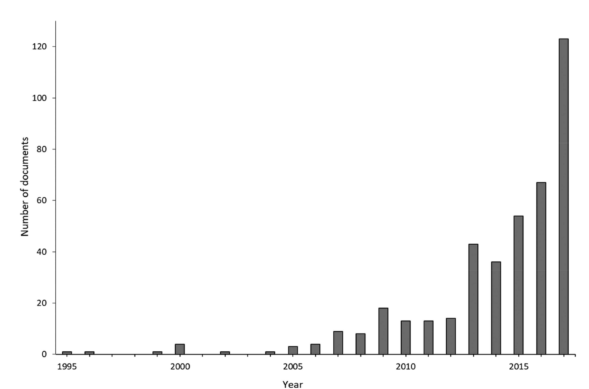
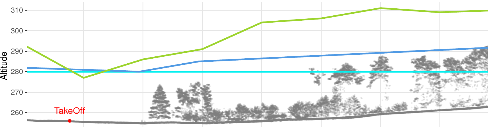
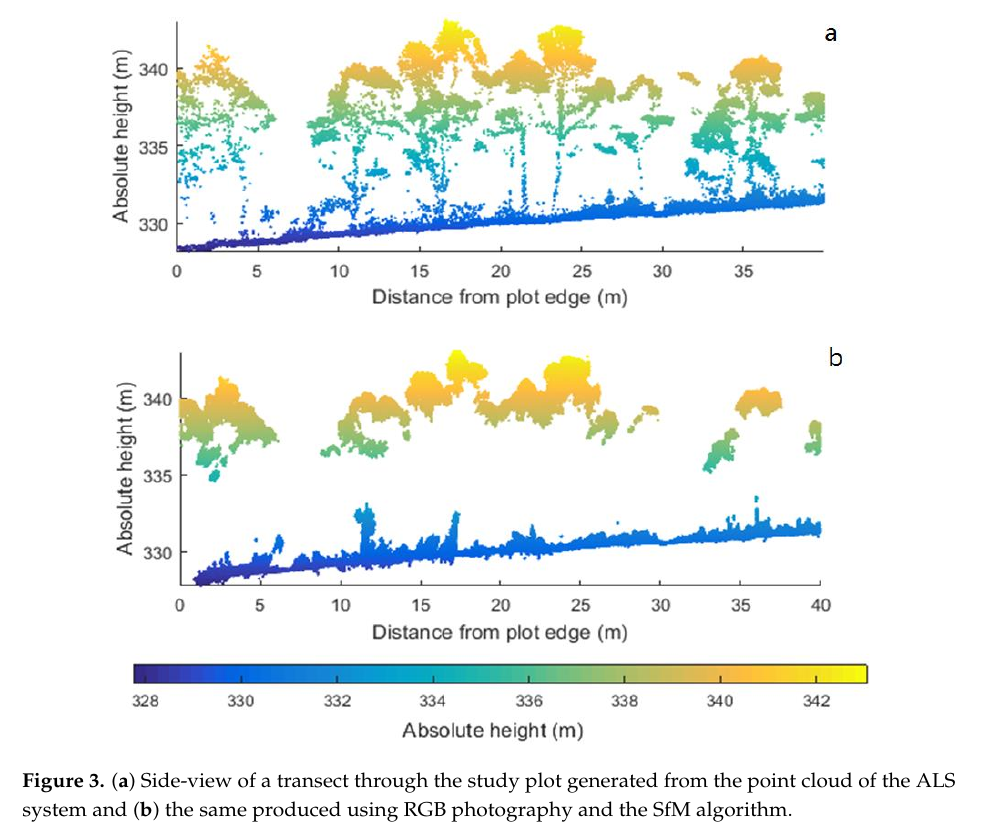
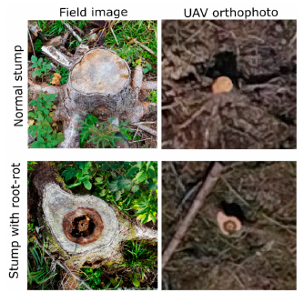
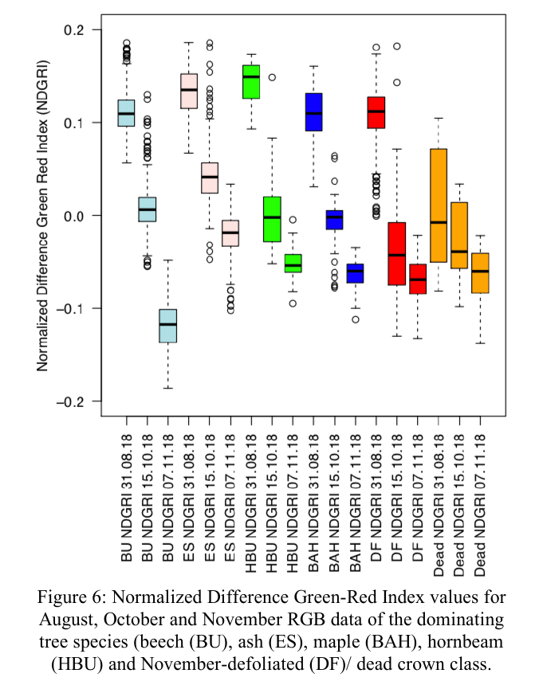
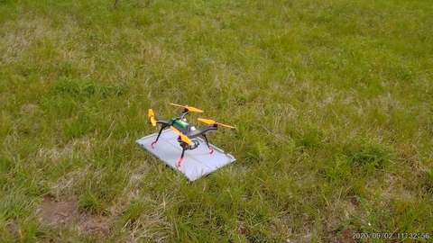
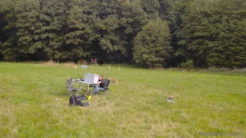
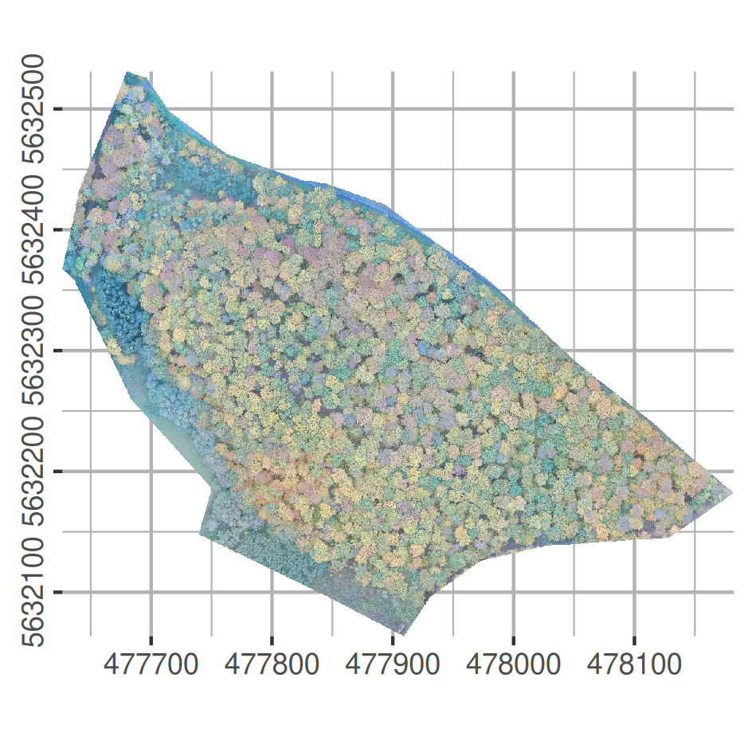
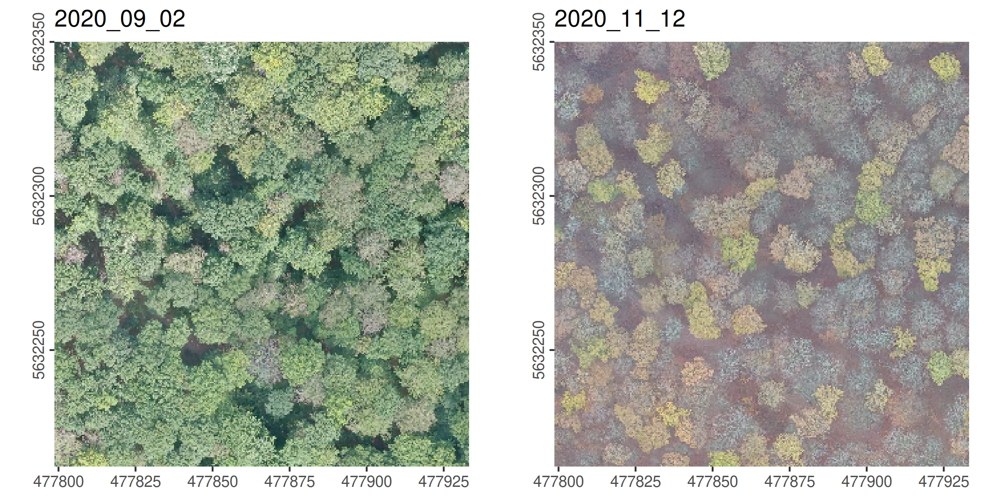

```{r setup, include=FALSE}
library(knitr)

opts_chunk$set(echo = FALSE,
               out.width = "75%", 
               fig.align = "center")
library(grid)
library(ggplot2)
library(mapview)
library(lidR)

library(rgl)
knitr::knit_hooks$set(webgl = hook_webgl)

```

## 

**Marvin Ludwig**

- Environmental monitoring and modelling
- Remote Sensing 
- Machine Learning
- UAS based data


```{r, fig.show = "hold", out.width = "30%", fig.align='right'}
knitr::include_graphics(c("assets/logo_envinfo.jpg", "assets/Natur40.png"))
```


## UAS publications in agriculture and forest

```{r, fig.cap="Raparelli & Bajocco (2019)"}

```

## UAS publications in forests

### Technical
- Structure from Motion in forests (Seifert et al. 2019)
- Difficulties (Iglhaut et al. 2019)
- Workflows (Ludwig et al. 2020)

```{r}

```

## UAS publications in forests

### Forest inventory
- canopy height, stem density, biomass...

```{r, fig.cap = "Wallace et al. 2016", out.width="50%"}

```


## UAS publications in forests

### Forest health

```{r, fig.cap="Puliti et al. 2019", out.width="50%"}

```

## UAS publications in forests

```{r, fig.cap="Hese et al. 2019", out.width="50%"}

```


# Goal: Utilizing UAS for operational application in forestry


## Study Area


```{r}
StudyArea = sf::st_read("data/mof_halfmoon.gpkg", quiet = TRUE)
mapview::mapview(StudyArea, fill = NA, color = "red", lwd = 2)
```


## Study Area

```{r, fig.cap="3DR Solo in the Marburg Open Forest"}

```


## Study Area

```{r, fig.cap="Ground station setup in the Marburg Open Forest with pilot Simon"}

```

## High resolution RGB: 2020-10-26

```{r}

```

## High resolution time series 2020

```{r}

```

## 3D Pointcloud: 2020-09-02


```{r, webgl = TRUE, message=FALSE, warning=FALSE}
#pc = readLAS("data/2020_09_02_densecloud_5p.laz")
#plot(pc, bg = "white", color= "RGB")
```

## 3D Pointcloud: 2020-11-12

```{r, webgl = TRUE, message=FALSE, warning=FALSE}
#pc = readLAS("data/2020_11_12_densecloud_5p.laz")
#plot(pc, bg = "white", color= "RGB")
```


